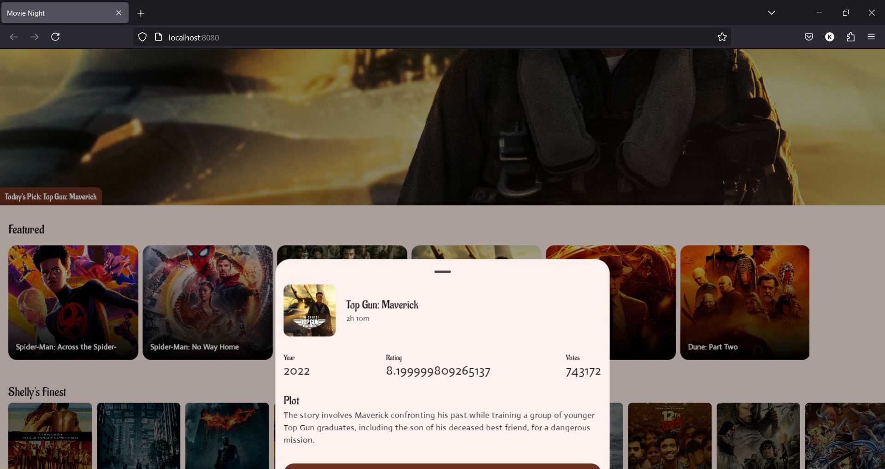

# Movie Night 🎥  

Movie Night is a sample Kotlin Multiplatform project designed to showcase a categorized collection of movies. Users can explore different movie categories and view detailed previews in a modal on click. This project demonstrates the capabilities of Compose Multiplatform and Clean Architecture principles, targeting Android, iOS, and Web platforms with a shared UI.  

## Features  

- **Compose Multiplatform UI**: Shared UI code written using Jetpack Compose for seamless cross-platform development.  
- **Categorized Movie Sections**: Movies are grouped into categories for easy exploration.  
- **Interactive Preview Modal**: Detailed preview of each movie is displayed in a modal upon user interaction.  
- **Kotlin Multiplatform**: Shared business logic for Android, iOS, and Web.  
- **Clean Architecture**: Clear separation of concerns with domain, data, and presentation layers.  

## Project Structure  

- **Shared**  
  - Contains all shared logic and UI components, written in Kotlin Multiplatform.  
- **Android**  
  - Platform-specific implementation for Android.  
- **iOS**  
  - Platform-specific implementation for iOS.  
- **Web**  
  - Platform-specific implementation for Web.  

## Tech Stack  

- **Kotlin Multiplatform**  
- **Compose Multiplatform**  
- **Ktor** for networking  
- **Coil** for image loading  
- **Coroutines** for asynchronous programming
- **Koin** for dependency injection

## How to Run  

1. Clone the repository:  
   ```bash  
   git clone https://github.com/kayMens/MovieNight.git
   ```
2. Navigate to the project directory:
   ```bash
    cd MovieNight  
   ```
3. Follow platform-specific instructions:
   - Android: Open the project in Android Studio and run the androidMain module.
   - iOS: Open the Xcode workspace generated by KMP and build the project.
   - Web: Use `:composeApp:wasmJsBrowserRun` to start the web app.
  
## Screenshots




## License

This project is open-source and available under the MIT License.
